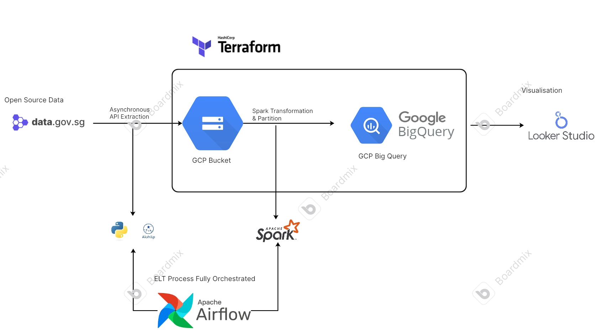
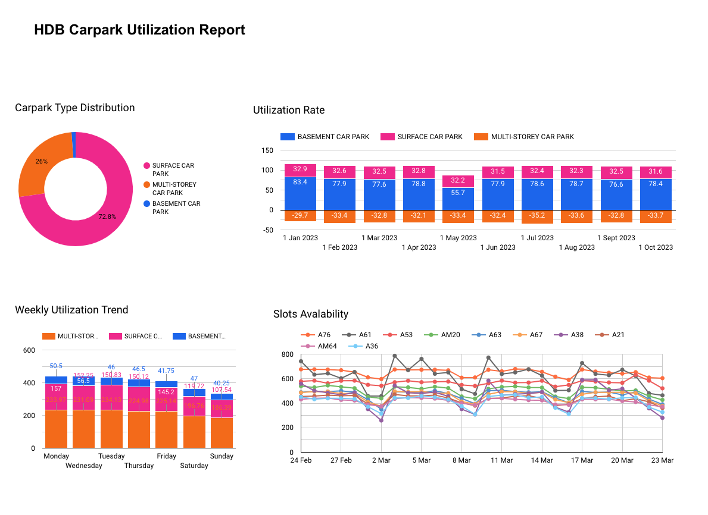
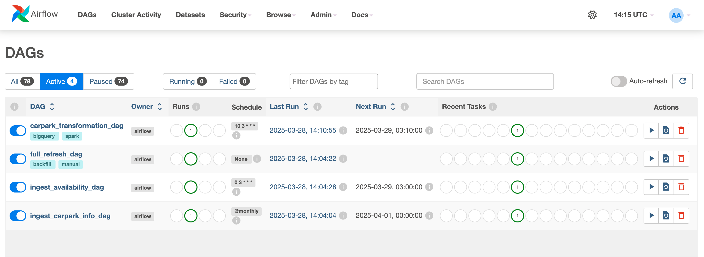

# DE-Zoomcamp-Project

## Problem Description: Singapore HDB Carpark Utilization Analysis 
The effective utilization of Housing & Developemtn Board (HDB) car parks is crucial for efficient urban mobility and resource management in Singapore. However, varying utilization rates across different car park types, fluctuations in weekly usage trends, and inconsistent slot availability present challenges in optimizing space allocation in this concise island. This project aims to analyze daily, weekly and monthly HDB car park utilization patterns, identify peak and underutilized periods, potentially provide data-driven recommendations to improve parking efficiency, reduce congestion, and enhance user experience.

## Data Source
The project use open data source provided by Singapore government in data.gov.sg. For simplicity, the project use 2 main data source: 
1. **Carpark Information**. This is a static csv updated monthly containing master information about carpark data, such as carpark location, type and other properties. 
 ```
Housing & Development Board. (2015). HDB Carpark Information (2025) [Dataset]. data.gov.sg. Retrieved March 25, 2025 from https://data.gov.sg/datasets/d_23f946fa557947f93a8043bbef41dd09/view
```
2. **Carpark Availability**. This is an open RestAPI which provide real time carpark availability information for every minutes. The API only takes in 1 parameter, which is the exact timestamp in YYYY-MM-DD[T]HH:mm:ss (SGT). For this project, we are doing batch processing, retriving data at 9am SGT per day from 2023 onwards. 
```
Housing & Development Board. (2018). Carpark Availability (2023) [Dataset]. data.gov.sg. Retrieved March 25, 2025 from https://data.gov.sg/datasets/d_ca933a644e55d34fe21f28b8052fac63/view
```

## Data Architecture

- **Data Ingestion**: 
    - **Carpark Information**: Updated **monthly**, orchestrated using **Airflow**.  
    - **Carpark Availability**: Updated **daily**, also managed by **Airflow**.  
    - **Full Refresh Job**: A backup strategy, you can trigger this manually in Airflow UI for a **bulk backfill** of historical data recovery in case of failures.  
    
- **Cloud and IaC**:
    - **Google Cloud Storage (GCS)**: Used as the primary data storage.  
    - **Terraform**: Manages GCP resources efficiently.  

- **Data Warehouse**: 
    - **Google BigQuery**: Stored processed data.  
    - **Partitioning & Clustering**: Optimized using **date-based partitions** for better query performance. Reason is, the data consist of *all* Sinagpore carpark information for each day, hence data volume for each day could be large -- especially if in future we have more than just 9am data but for every hour in the day. Even though the data size is smaller now which means clustering will work too, date based partition (by date / by month, depends on which table) is more ideal considering future volume of the dataset could be huge. This step is done as part of spark transformation. 

- **Spark Data Transformation**: 
    - **Apache Spark**: Used for **batch processing** and data transformation.  
        - carpark_details: Combine all daily carpark availability information under into one single dataframe. 
        - carpark_df: Join carpark_details with the master carpark information data, to show more details of carpark type, location etc. 
        - utilization_by_region: Performed a groupby on carpark_df to compute average utilization rate per region and time period (year month, and day of week). 
    - **Airflow Orchestration**: Ensures transformations run **daily** after data ingestion.  

- **Airflow**: 
    - Airflow is the industrial standard for data pipeline orchestration. Here, we use the fundamental concept of DAG (Directed Acyclic Graph) which represents a data pipeline (i.e. workflow) and the sequence of tasks. It also allows us to determine the cron job schedule. 
    - What are the DAGs defined? 
        - **full_refresh_dag**, it will trigger a bulk backfill to ingest all historical data in from 2023 until one day before current day. This is to save time as the ingestion is done using acynchronous call. 
        - **ingest_availability_dag**, once activated, you should be able to see it ingesting daily 9am SGT data as a new csv file into your GCP at UCT 3am daily. 
        - **ingest_carpark_info_dag**, this is a monthly refreshed dag. 
        - **transformation_dag**, it is designed to run 10 min after daily_ingestion. This will run the transformation script under spark_transformation/ to perform data transformation to the data. 
        - Backfill has been disabled for some of the dag and hence when you enter the UI, some tasks will not run automatically. You can run all these 4 tasks once, and verify your data has been loaded into GCP Bucket and transformed in BigQuery. 

## Dashboard 
- You can access the dashbaord with this link: [Carpark Availability Dashboard](https://lookerstudio.google.com/s/tTT2DmQAzzU)
- or view the dashboard here: 

- Observation:  
    1. Majority of the Singapore HDB carpark type are surface carpark. However, basement carpark has a higher utilization rate. This could be correlated to the year that the HDB was built and the population of that cluster (usually, surface carpark are for HDB built earlier before 21st century, with majority of the residents being elderlies who does not own car. Basement carpark are  rare for HDB, but usually for newly estabished ones with a younger resident portfolio).
    2. It makes sense that over the weekends, utilization rate are usually lower, as people might choose to go for short trips. 
     


## Reproducability 
- **Pre-requisit**: 
    1. You need to have a GCP account and a GCP Project set up. You need to download your service account json file locally first. Your service account should have the following permission: 
        - BigQuery Admin
        - Compute Admin
        - Storage Admim 
    2. Generate and save locally your private and public ssh key for GCP. Add the public ssh key in your GCP under Compute Engine / Metadata. 
    [create-ssh-keys](https://cloud.google.com/compute/docs/connect/create-ssh-keys)
    3. Create a virtual machine on your GCP Project with 30GB of disk storage (I used Ubuntu here, 30GB just to play safe), e2-standard-4, and a region you prefer. 
    4. Create .config file under .ssh/ directory and paste the following code in: 
    ```
    Host <VM Name>
    HostName <External IP Address>
    User <Your Name>
    IdentityFile <Path-To-Your-Private-SSH-KEY>
    ```
    5. If you have VS Code, you can download the Remote-SSH extension and directly connect there. Otherwise, connect in cmd using
     ```
     ssh <VM Name>
     ```
    Refer to the set up video to find out more: [Setting up the Environment on Google Cloud](https://youtu.be/ae-CV2KfoN0?si=m66e_1caSyOhEjyR)
- **After you have a valid VM**: 
    1. Git Clone the repo into the VM: 
        ```
        git clone https://github.com/liuchennn1414/DE-Zoomcamp-Project.git
        ```
    2. In your terminal, (I recommend you to use VSCode to open the git repo :)), do: 
        ```
        chmod +x ~/DE-Zoomcamp-Project/docker-setup.sh
        bash ~/DE-Zoomcamp-Project/docker-setup.sh
        newgrp docker
        ``` 
        Followed by: 
        ```
        chmod +x ~/DE-Zoomcamp-Project/docker-setup2.sh
        bash ~/DE-Zoomcamp-Project/docker-setup2.sh
        ```
        This will help you automatically download Docker and Terraform. 
    3. You need to update your environment variable with your own project detail. 
        - Firstly, let's copy your credential into the VM:     
            - locally, cd to the directory containing your credential 
            - sftp to your vm 
            - mkdir .gc
            - cd .gc 
            - put google-credential.json 
        - Back to your VM, go to .env file, update your project id and bucket name. 
        - Once you are done with that, run: 
            ```
            source .env 
            ``` 
            to export these environment variables. 
        - authenticate GCP: 
            ```
            gcloud auth activate-service-account --key-file $GOOGLE_APPLICATION_CREDENTIALS
            ```

    4. We will then use Terraform to create the necessary GCP Resources (Bucket & Bigquery). 

            ```
            cd DE-Zoomcamp-Project/terraform

            terraform init 

            terraform plan 

            terraform apply 
            ```
    5. Next, we will download docker, and set up airflow. 
        ```
        chmod +x ~/DE-Zoomcamp-Project/airflow-setup.sh
        ``` 
        Followed by: 
        ```
        bash ~/DE-Zoomcamp-Project/airflow-setup.sh
        ```
    6. You are all set. cd to the project repo and start the project with the following command: 
    ```
    docker-compose up airflow-init
    docker-compose up 
    ```  
    Take note if you face permissin denied issue, you can rerun the 2 docker setup bash script one more time. 

    This will create the airflow image with all necessary packages (spark, python, aiohttp etc.) for you.  
    7. Open up another terminal and run docker ps. You should see 6 containers running with status = 'healthy'. Once they are all at healthy status, you should also see the port being automatically forwarded to your local host.  
    - Go to [localhost:8080](localhost:8080)
    - Sign in to airflow with both username & password = airflow.  
    - Activate the 4 dags there. (See picture below which 4 dags). 
    - Make sure you trigger the transformation_dag the last as it requires the data to be inside your GCP bucket first. 
    

## Next Step of improvement 
The pipeline is still very naive. Here are some next step: 
1. Use dataproc on GCP for spark job other than local spark job 
2. Re-examine the efficiency of using spark for data transformation since the data size could be big and also could be small. I am using spark because... I want to be familiarize with how to use it ;) 
3. Optimize the airflow pipeline, from setting up & downstream to incremental load, to more efficienct and cleaner repo structure. 
4. Potential expansion in 2 direction: 
    a. Look into HDB rent / selling price
    b. Look into expanding this carpark app into a real time api project since the api is available for real time access 
5. Use other API, which could potentially require authentication and use of tools like dlt
6. Automate the initial set up with makefile / shell script. Set up the VM with terraform to better utilize the power of IaC. 
7. Create VM with terraform, too. 
